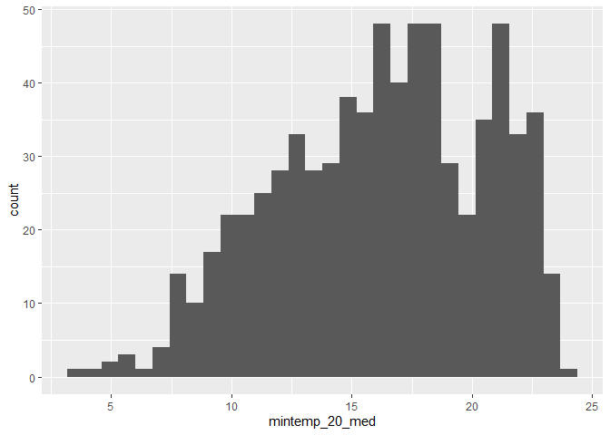

Geog6300: Lab 6
================

## Regression

``` r
library(sf)
library(tidyverse)
```

**Overview:** This lab focuses on regression techniques. You’ll be
analyzing the association of various physical and climatological
characteristics in Australia with observations of several animals
recorded on the citizen science app iNaturalist.

\###Data and research questions###

Let’s import the dataset.

``` r
lab6_data<-st_read("data/aus_climate_inat.gpkg")
```

    ## Reading layer `aus_climate_inat' from data source 
    ##   `C:\Users\rdjglobal\OneDrive - University of Georgia\Fall 2024\GEOG 4300\geog4-6300-lab-6-jdp41499\data\aus_climate_inat.gpkg' 
    ##   using driver `GPKG'
    ## Simple feature collection with 716 features and 22 fields
    ## Geometry type: POLYGON
    ## Dimension:     XY
    ## Bounding box:  xmin: 113.875 ymin: -43.38632 xmax: 153.375 ymax: -11.92074
    ## Geodetic CRS:  WGS 84 (CRS84)

The dataset for this lab is a 1 decimal degree hexagon grid that has
aggregate statistics for a number of variables:

- ndvi: NDVI/vegetation index values from Landsat data (via Google Earth
  Engine). These values range from -1 to 1, with higher values
  indicating more vegetation.
- maxtemp_00/20_med: Median maximum temperature (C) in 2000 or 2020
  (data from SILO/Queensland government)
- mintemp_00/20_med: Median minimum temperature (C) in 2020 or 2020
  (data from SILO/Queensland government)
- rain_00/20_sum: Total rainfall (mm) in 2000 or 2020 (data from
  SILO/Queensland government)
- pop_00/20: Total population in 2000 or 2020 (data from NASA’s Gridded
  Population of the World)
- water_00/20_pct: Percentage of land covered by water at some point
  during the year in 2000 or 2020
- elev_med: Median elevation (meters) (data from the Shuttle Radar
  Topography Mission/NASA)

There are also observation counts from iNaturalist for several
distinctively Australian animal species: the central bearded dragon, the
common emu, the red kangaroo, the agile wallaby, the laughing
kookaburra, the wombat, the koala, and the platypus.

Our primary research question is how the climatological/physical
variables in our dataset are predictive of the NDVI value. We will build
models for 2020 as well as the change from 2000 to 2020. The second is
referred to as a “first difference” model and can sometimes be more
useful for identifying causal mechanisms.

\###Part 1: Analysis of 2020 data###

We will start by looking at data for 2020.

**Question 1** *Create histograms for NDVI, max temp., min temp., rain,
and population, and water in 2020 as well as elevation. Based on these
graphs, assess the normality of these variables.*

``` r
ggplot(lab6_data,aes(x=ndvi_20_med)) + geom_histogram()
```

    ## `stat_bin()` using `bins = 30`. Pick better value with `binwidth`.

<!-- -->

``` r
ggplot(lab6_data,aes(x=maxtemp_20_med)) + geom_histogram()
```

    ## `stat_bin()` using `bins = 30`. Pick better value with `binwidth`.

<!-- -->

``` r
ggplot(lab6_data,aes(x=mintemp_20_med)) + geom_histogram()
```

    ## `stat_bin()` using `bins = 30`. Pick better value with `binwidth`.

<!-- -->

``` r
ggplot(lab6_data,aes(x=rain_20_sum)) + geom_histogram()
```

    ## `stat_bin()` using `bins = 30`. Pick better value with `binwidth`.

<!-- -->

``` r
ggplot(lab6_data,aes(x=pop_20)) + geom_histogram()
```

    ## `stat_bin()` using `bins = 30`. Pick better value with `binwidth`.

<!-- -->

``` r
ggplot(lab6_data,aes(x=water_20_pct)) + geom_histogram()
```

    ## `stat_bin()` using `bins = 30`. Pick better value with `binwidth`.

<!-- -->

ndvi: right skewed max temp: left skewed min temp: close to normal, a
little left skewed rain: right skewed population: right skewed water:
right skewed

**Question 2** *Use tmap to map these same variables using Jenks natural
breaks as the classification method. For an extra challenge, use
`tmap_arrange` to plot all maps in a single figure.*

``` r
library(tmap)
```

    ## Warning: package 'tmap' was built under R version 4.3.3

    ## Breaking News: tmap 3.x is retiring. Please test v4, e.g. with
    ## remotes::install_github('r-tmap/tmap')

``` r
map1<-tm_shape(lab6_data)+tm_polygons("ndvi_20_med", style = "jenks")
map2<-tm_shape(lab6_data)+tm_polygons("maxtemp_20_med", style = "jenks")
map3<-tm_shape(lab6_data)+tm_polygons("mintemp_20_med", style = "jenks")
map4<-tm_shape(lab6_data)+tm_polygons("rain_20_sum", style = "jenks")
map5<-tm_shape(lab6_data)+tm_polygons("pop_20", style = "jenks")
map6<-tm_shape(lab6_data)+tm_polygons("water_20_pct", style = "jenks")

tmap_arrange(map1, map2, map3, map4, map5, map6, ncol=3, nrow=2)
```

    ## Legend labels were too wide. The labels have been resized to 0.56, 0.56, 0.56, 0.56, 0.56. Increase legend.width (argument of tm_layout) to make the legend wider and therefore the labels larger.

    ## Legend labels were too wide. The labels have been resized to 0.56, 0.56, 0.56, 0.56, 0.56. Increase legend.width (argument of tm_layout) to make the legend wider and therefore the labels larger.

    ## Legend labels were too wide. The labels have been resized to 0.48, 0.44, 0.41, 0.41, 0.41. Increase legend.width (argument of tm_layout) to make the legend wider and therefore the labels larger.

    ## Some legend labels were too wide. These labels have been resized to 0.48, 0.44, 0.41, 0.41. Increase legend.width (argument of tm_layout) to make the legend wider and therefore the labels larger.

    ## Legend labels were too wide. The labels have been resized to 0.56, 0.56, 0.56, 0.56, 0.56. Increase legend.width (argument of tm_layout) to make the legend wider and therefore the labels larger.

<!-- -->

**Question 3** *Based on the maps from question 3, summarise major
patterns you see in the spatial distribution of these data from any of
your variables of interest. How do they appear to be associated with the
NDVI variable?*

Maxtemp_20_med and mintemp_20,med appear to be negatively associated
with ndvi, while rain_20_sum and pop_20 appear to be positively
associated with ndvi. Water_20_pct does not appear to have any
association with ndvi, since the patterns do not match positively or
negatively.

**Question 4** *Create univariate models for each of the variables
listed in question 1, with NDVI in 2020 as the dependent variable. Print
a summary of each model. Write a summary of those results that indicates
the direction, magnitude, and significance for each model coefficient.*

``` r
model1<-lm(ndvi_20_med~maxtemp_20_med, data=lab6_data)
summary(model1)
```

    ## 
    ## Call:
    ## lm(formula = ndvi_20_med ~ maxtemp_20_med, data = lab6_data)
    ## 
    ## Residuals:
    ##      Min       1Q   Median       3Q      Max 
    ## -0.41874 -0.07657 -0.01927  0.06833  0.36382 
    ## 
    ## Coefficients:
    ##                  Estimate Std. Error t value Pr(>|t|)    
    ## (Intercept)     0.6612389  0.0294372   22.46   <2e-16 ***
    ## maxtemp_20_med -0.0130902  0.0009601  -13.63   <2e-16 ***
    ## ---
    ## Signif. codes:  0 '***' 0.001 '**' 0.01 '*' 0.05 '.' 0.1 ' ' 1
    ## 
    ## Residual standard error: 0.1251 on 714 degrees of freedom
    ## Multiple R-squared:  0.2066, Adjusted R-squared:  0.2055 
    ## F-statistic: 185.9 on 1 and 714 DF,  p-value: < 2.2e-16

``` r
model2<-lm(ndvi_20_med~mintemp_20_med, data=lab6_data)
summary(model2)
```

    ## 
    ## Call:
    ## lm(formula = ndvi_20_med ~ mintemp_20_med, data = lab6_data)
    ## 
    ## Residuals:
    ##      Min       1Q   Median       3Q      Max 
    ## -0.36375 -0.08418 -0.03047  0.06972  0.40383 
    ## 
    ## Coefficients:
    ##                 Estimate Std. Error t value Pr(>|t|)    
    ## (Intercept)     0.464461   0.018997   24.45   <2e-16 ***
    ## mintemp_20_med -0.012282   0.001131  -10.86   <2e-16 ***
    ## ---
    ## Signif. codes:  0 '***' 0.001 '**' 0.01 '*' 0.05 '.' 0.1 ' ' 1
    ## 
    ## Residual standard error: 0.1301 on 714 degrees of freedom
    ## Multiple R-squared:  0.1418, Adjusted R-squared:  0.1406 
    ## F-statistic:   118 on 1 and 714 DF,  p-value: < 2.2e-16

``` r
model3<-lm(ndvi_20_med~rain_20_sum, data=lab6_data)
summary(model3)
```

    ## 
    ## Call:
    ## lm(formula = ndvi_20_med ~ rain_20_sum, data = lab6_data)
    ## 
    ## Residuals:
    ##      Min       1Q   Median       3Q      Max 
    ## -0.56681 -0.04753 -0.01210  0.04599  0.30930 
    ## 
    ## Coefficients:
    ##              Estimate Std. Error t value Pr(>|t|)    
    ## (Intercept) 1.303e-01  7.060e-03   18.45   <2e-16 ***
    ## rain_20_sum 9.124e-07  3.953e-08   23.08   <2e-16 ***
    ## ---
    ## Signif. codes:  0 '***' 0.001 '**' 0.01 '*' 0.05 '.' 0.1 ' ' 1
    ## 
    ## Residual standard error: 0.1063 on 714 degrees of freedom
    ## Multiple R-squared:  0.4273, Adjusted R-squared:  0.4265 
    ## F-statistic: 532.6 on 1 and 714 DF,  p-value: < 2.2e-16

``` r
model4<-lm(ndvi_20_med~pop_20, data=lab6_data)
summary(model4)
```

    ## 
    ## Call:
    ## lm(formula = ndvi_20_med ~ pop_20, data = lab6_data)
    ## 
    ## Residuals:
    ##      Min       1Q   Median       3Q      Max 
    ## -0.47003 -0.07883 -0.03949  0.06384  0.48974 
    ## 
    ## Coefficients:
    ##              Estimate Std. Error t value Pr(>|t|)    
    ## (Intercept) 2.552e-01  5.013e-03  50.902   <2e-16 ***
    ## pop_20      1.500e-06  1.500e-07   9.998   <2e-16 ***
    ## ---
    ## Signif. codes:  0 '***' 0.001 '**' 0.01 '*' 0.05 '.' 0.1 ' ' 1
    ## 
    ## Residual standard error: 0.1316 on 714 degrees of freedom
    ## Multiple R-squared:  0.1228, Adjusted R-squared:  0.1216 
    ## F-statistic: 99.97 on 1 and 714 DF,  p-value: < 2.2e-16

``` r
model5<-lm(ndvi_20_med~water_20_pct, data=lab6_data)
summary(model5)
```

    ## 
    ## Call:
    ## lm(formula = ndvi_20_med ~ water_20_pct, data = lab6_data)
    ## 
    ## Residuals:
    ##      Min       1Q   Median       3Q      Max 
    ## -0.26898 -0.08838 -0.04838  0.06871  0.50911 
    ## 
    ## Coefficients:
    ##               Estimate Std. Error t value Pr(>|t|)    
    ## (Intercept)   0.268988   0.006287  42.781   <2e-16 ***
    ## water_20_pct -0.178263   0.154480  -1.154    0.249    
    ## ---
    ## Signif. codes:  0 '***' 0.001 '**' 0.01 '*' 0.05 '.' 0.1 ' ' 1
    ## 
    ## Residual standard error: 0.1403 on 714 degrees of freedom
    ## Multiple R-squared:  0.001862,   Adjusted R-squared:  0.0004636 
    ## F-statistic: 1.332 on 1 and 714 DF,  p-value: 0.2489

The first model with the maxtemp_20_med variable has an estimate of
-0.01, which indicates that as maxtemp_20_med increases by 1, then ndvi
decreases by 0.01. The p value is about 0, which indicates a high
significance.

The second model with the mintemp_20_med variable has an estimate of
-0.01, which indicates that as mintemp_20_med increases by 1, then ndvi
decreases by 0.01. The p value is about 0, which indicates a high
significance.

The third model with the rain_20_sum variable has an estimate of
0.0000009, which indicates that as rain_20_sum increases by 1, then ndvi
remains about constant (minuscule increase of 0.0000009). The p value is
about 0, which indicates a high significance.

The fourth model with the pop_20 variable has an estimate of 0.000001,
which indicates that as pop_20 increases by 1, then ndvi remains about
constant (minuscule increase of 0.000001). The p value is about 0, which
indicates a high significance.

The fifth model with the water_20_pct variable has an estimate of
0.000001, which indicates that as water_20_pct increases by 1, then ndvi
remains about constant (minuscule increase of 0.000001). The p value is
about 0.249, which indicates a low significance.

**Question 5** *Create a multivariate regression model with the
variables of interest, choosing EITHER max or min temperature (but not
both) You may also choose to leave out any variables that were
insignificant in Q4. Use the univariate models as your guide. Call the
results.*

``` r
multi_model<-lm(ndvi_20_med~maxtemp_20_med+rain_20_sum+pop_20, data=lab6_data)
summary(multi_model)
```

    ## 
    ## Call:
    ## lm(formula = ndvi_20_med ~ maxtemp_20_med + rain_20_sum + pop_20, 
    ##     data = lab6_data)
    ## 
    ## Residuals:
    ##      Min       1Q   Median       3Q      Max 
    ## -0.54167 -0.02238  0.00814  0.03759  0.17686 
    ## 
    ## Coefficients:
    ##                  Estimate Std. Error t value Pr(>|t|)    
    ## (Intercept)     4.922e-01  2.202e-02  22.351  < 2e-16 ***
    ## maxtemp_20_med -1.179e-02  7.012e-04 -16.812  < 2e-16 ***
    ## rain_20_sum     8.648e-07  3.357e-08  25.766  < 2e-16 ***
    ## pop_20          3.024e-07  1.077e-07   2.808  0.00513 ** 
    ## ---
    ## Signif. codes:  0 '***' 0.001 '**' 0.01 '*' 0.05 '.' 0.1 ' ' 1
    ## 
    ## Residual standard error: 0.0872 on 712 degrees of freedom
    ## Multiple R-squared:  0.6158, Adjusted R-squared:  0.6142 
    ## F-statistic: 380.4 on 3 and 712 DF,  p-value: < 2.2e-16

**Question 6** *Summarize the results of the multivariate model. What
are the direction, magnitude, and significance of each coefficient? How
did it change from the univariate models you created in Q4 (if at all)?
What do the R2 and F-statistic values tell you about overall model fit?*

The first coefficient with the maxtemp_20_med variable has an estimate
of about -0.02, which indicates that as maxtemp_20_med increases by 1,
then ndvi decreases by about -0.02. The p value is about 0, which
indicates a high significance.

The second coefficient with the rain_20_sum variable has an estimate of
about 0.0000008, which indicates that as rain_20_sum increases by 1,
then ndvi remains about constant (minuscule increase of 0.0000008). The
p value is about 0, which indicates a high significance.

The second coefficient with the pop_20 variable has an estimate of about
0.0000003, which indicates that as pop_20 increases by 1, then ndvi
remains about constant (minuscule increase of 0.0000003). The p value is
about 0.005, which indicates a fairly high significance.

The values did not change much from the univariate models above. The R^2
value of about 0.61 says that about 61% of the ndvi variation is
explained by the model. The F-statistic p value of about zero shows that
the model shows a large percentage of the variation, making it a fairly
useful model.

**Question 7** *Use a histogram and a map to assess the normality of
residuals and any spatial autocorrelation. Summarise any notable
patterns that you see.*

``` r
hist(residuals(multi_model))
```

<!-- -->

``` r
lab6_data$residuals<-residuals(multi_model)
tm_shape(lab6_data)+tm_polygons("residuals")
```

    ## Variable(s) "residuals" contains positive and negative values, so midpoint is set to 0. Set midpoint = NA to show the full spectrum of the color palette.

<!-- -->

The histogram indicates that the residuals are about normally
distributed, with a small group residuals less than -0.2. The map
indicates that all residuals are near the coasts of the Australian
continent, with none being in the interior part.

**Question 8** *Assess any issues with multicollinearity or
heteroskedastity in this model using the techniques shown in class. Run
the appropriate tests and explain what their results show you.*

``` r
library(lmtest)
```

    ## Warning: package 'lmtest' was built under R version 4.3.3

    ## Loading required package: zoo

    ## Warning: package 'zoo' was built under R version 4.3.3

    ## 
    ## Attaching package: 'zoo'

    ## The following objects are masked from 'package:base':
    ## 
    ##     as.Date, as.Date.numeric

``` r
library(car)
```

    ## Warning: package 'car' was built under R version 4.3.3

    ## Loading required package: carData

    ## Warning: package 'carData' was built under R version 4.3.3

    ## 
    ## Attaching package: 'car'

    ## The following object is masked from 'package:dplyr':
    ## 
    ##     recode

    ## The following object is masked from 'package:purrr':
    ## 
    ##     some

``` r
bptest(multi_model)
```

    ## 
    ##  studentized Breusch-Pagan test
    ## 
    ## data:  multi_model
    ## BP = 65.65, df = 3, p-value = 3.642e-14

``` r
vif(multi_model)
```

    ## maxtemp_20_med    rain_20_sum         pop_20 
    ##       1.098341       1.071548       1.173265

Since the p-value for the bptest is about 0, we can reject the null
hypothesis, suggesting there is heteroskedasticity. The vif test
produces all values below 5, suggesting there is no multicollinearity.

**Question 9** *How would you summarise the results of this model in a
sentence or two? In addition, looking at the full model and your
diagnostics, do you feel this is a model that provides meaningful
results? Explain your answer.*

Overall, the model is somewhat useful. It captures the majority (61%) of
the residuals and has three significant variables. However, 39% of the
variation is not explained plus there is evidence of heteroskedasticity.

**Disclosure of assistance:** *Besides class materials, what other
sources of assistance did you use while completing this lab? These can
include input from classmates, relevant material identified through web
searches (e.g., Stack Overflow), or assistance from ChatGPT or other AI
tools. How did these sources support your own learning in completing
this lab?*

I used ChatGPT to conceptually understand several of these tests I
performed. I tried to understand what the values meant and what to look
for in the outputs.

**Lab reflection:** *How do you feel about the work you did on this lab?
Was it easy, moderate, or hard? What were the biggest things you learned
by completing it?*

Overall, this lab was moderately difficult. The coding part of it was
pretty easy, but conceptually understanding all of the tests and what
they did was a little tricky.

**Challenge question**

\#Option 1 Create a first difference model. To do that, subtract the
values in 2000 from the values in 2020 for each variable for which that
is appropriate. Then create a new model similar to the one you created
in question 5, but using these new variables showing the *change in
values* over time. Call the results of the model, and interpret the
results in the same ways you did above. Also chart and map the residuals
to assess model error. Finally, write a short section that summarises
what, if anything, this model tells you.

\#Option 2 The animal data included in this dataset is an example of
count data, and usually we would use a Poisson or similar model for that
purpose. Let’s try it with regular OLS regression though. Create two
regression models to assess how the counts of two different animals
(say, koalas and emus) are associated with at least three of the
environmental/climatological variables given above. Be sure to use the
same independent variables in each model. Interpret the results of each
model and then explain the importance of any differences in the model
coefficients between them, focusing on direction, magnitude, and
significance.

``` r
emu_model<-lm(Common.emu~maxtemp_20_med+rain_20_sum+water_20_pct, data=lab6_data)
summary(emu_model)
```

    ## 
    ## Call:
    ## lm(formula = Common.emu ~ maxtemp_20_med + rain_20_sum + water_20_pct, 
    ##     data = lab6_data)
    ## 
    ## Residuals:
    ##    Min     1Q Median     3Q    Max 
    ## -60.54 -10.57  -2.78   2.13 503.13 
    ## 
    ## Coefficients:
    ##                  Estimate Std. Error t value Pr(>|t|)    
    ## (Intercept)     7.944e+01  8.839e+00   8.988   <2e-16 ***
    ## maxtemp_20_med -2.329e+00  2.736e-01  -8.511   <2e-16 ***
    ## rain_20_sum     1.138e-05  1.322e-05   0.861    0.390    
    ## water_20_pct   -1.779e+01  3.930e+01  -0.453    0.651    
    ## ---
    ## Signif. codes:  0 '***' 0.001 '**' 0.01 '*' 0.05 '.' 0.1 ' ' 1
    ## 
    ## Residual standard error: 35.45 on 712 degrees of freedom
    ## Multiple R-squared:  0.09427,    Adjusted R-squared:  0.09045 
    ## F-statistic:  24.7 on 3 and 712 DF,  p-value: 3.262e-15

``` r
wombat_model<-lm(Wombat~maxtemp_20_med+rain_20_sum+water_20_pct, data=lab6_data)
summary(wombat_model)
```

    ## 
    ## Call:
    ## lm(formula = Wombat ~ maxtemp_20_med + rain_20_sum + water_20_pct, 
    ##     data = lab6_data)
    ## 
    ## Residuals:
    ##     Min      1Q  Median      3Q     Max 
    ## -164.56  -20.94   -1.80   12.66  851.84 
    ## 
    ## Coefficients:
    ##                  Estimate Std. Error t value Pr(>|t|)    
    ## (Intercept)     1.125e+02  1.728e+01   6.511 1.41e-10 ***
    ## maxtemp_20_med -4.341e+00  5.348e-01  -8.117 2.11e-15 ***
    ## rain_20_sum     1.989e-04  2.584e-05   7.697 4.67e-14 ***
    ## water_20_pct   -4.667e+01  7.681e+01  -0.608    0.544    
    ## ---
    ## Signif. codes:  0 '***' 0.001 '**' 0.01 '*' 0.05 '.' 0.1 ' ' 1
    ## 
    ## Residual standard error: 69.29 on 712 degrees of freedom
    ## Multiple R-squared:  0.1555, Adjusted R-squared:  0.152 
    ## F-statistic: 43.72 on 3 and 712 DF,  p-value: < 2.2e-16

For the emu model, the maxtemp_20_med was significant, with an
coefficient of about -2.33. This means that as maxtemp_20_med increases
by 1, emu count decreases by 2.33. This was the only significant
variable. The R squared value was 0.09, suggesting that the vast
majority of residuals were not explained by the model.

For the wombat model, the maxtemp_20_med was significant, with an
coefficient of about -4.34. This means that as maxtemp_20_med increases
by 1, wombat count decreases by 4.34. The rain_20_sum was also
significant, with an coefficient of about 0.0002. This means that as
rain_20_sum increases by 1, wombat count increases by 0.0002. The other
variable was not significant. The R squared value was 0.15, suggesting
that the vast majority of residuals were not explained by the model.

Overall, neither model was very good. Both had extremely low R squared
values and had statistically insignificant variables. Better models
could be found for these animals.
